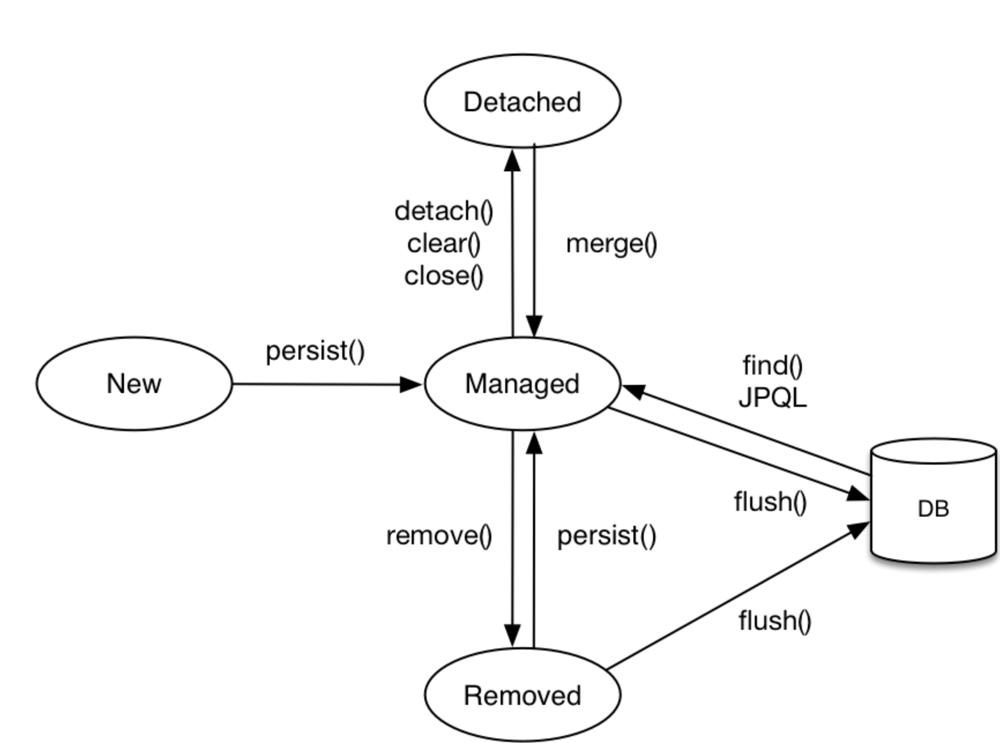
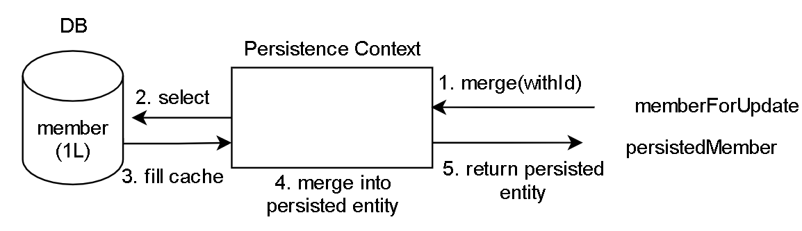
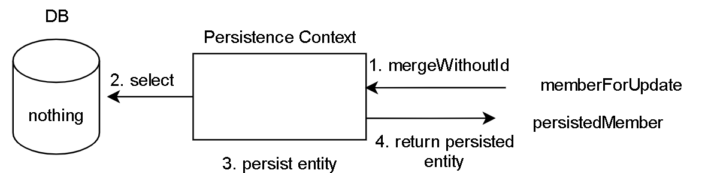

# 1주차

## JPA(Java Persistence API)

- 개념
  - 자바 ORM 기술에 대한 표준 명세로, JAVA에서 제공하는 API이다
  - 자바 어플리케이션에서 관계형 데이터베이스를 사용하는 방식을 정의한 인터페이스
  - ORM이기 때문에 자바 클래스와 DB테이블을 매핑한다
  - JPA를 사용하기 위해서는 JPA를 구현한 Hibernate, EclipseLink, DataNucleus같은 ORM 프레임워크를 사용


  

- 장점
  - SQL 중심적인 개발이 아닌 객체 중심 개발이 가능
  - JPA가 중간에서 매핑을 해주므로 자바 프로그래밍에 적합하게 객체지향적 개발이 가능
  - 성능 향상 기대

- 단점
  - 객체 간의 매핑 설계에 어려움이 있음(이로인한 성능 저하도 발생할 수 있음)
  - JPA를 제대로 사용하려면 알아야 할 것이 많아서 학습하는 데 시간이 오래 걸린다.
  - 통계 쿼리처럼 매우 복잡한 SQL을 작성하기에는 적합하지 않다

## 영속성 관리

### Persistence Context내의 엔티티의 생명주기



### Persist
  - 엔티티 객체를 생성했다면, 이 객체는 Transient/New 상태
  - 엔티티를 Persistence Context가 관리하도록 하기 위해서는 persist 메서드를 호출
  - managed(영속)상태로 진입
  - flush() 호출 시 디비에 반영
```
    Article article = new Article(content); // Transient/New 
    em.persist(article);   // Managed
```

### Detach
  - 엔티티가 managed인 상태에서 detach 메서드를 호출하면, 해당 엔티티는 detached 상태
  - 더이상 Persistence Context에 의해 관리를 받지 않게 됨
 ```
    em.detach(article);
    article.setContent(anotherContent); // will not saved automatically
```

### Merge
  - detached 상태의 인스턴스를 이용해, Persistence Context나 DB의 엔티티를 업데이트
  - Merge의 기본 동작
    ```
    member.setId(id);
    em.merge(member);
    ```
    
  
  1. 처음에 member가 merge 메서드의 매개변수로 전달되면, 이 member의 id가 있는지 파악합니다. 
  2. id가 있었고, Persistence Context에 해당 id의 엔티티가 있었다면 4번으로 넘어갑니다. 그렇지 않은 경우, DB에 해당 id에 해당하는 엔티티를 요청합니다. 
  3. 응답받은 엔티티를 Persistence Context에 저장합니다. 
  4. 이제 merge의 대상으로 들어온 엔티티의 내용을 영속성이 보장중이던(Persistence Context안에 있던) 엔티티에 반영합니다.
  5. (중요) merge 후 영속성이 보장중인 엔티티를 반환합니다. 이 때, 기존 merge로 전달된 member 엔티티는 여전히 detached 상태입니다. merge를 한 후에 merge의 대상으로 전달되었던 member를 갱신하더라도 이 내용은 변경감지에 포함되지 않기 때문에 수정이 되지 않습니다
  
  - Merge는 Persist 기능을 포함
    
    
  1. merge에 member 엔티티가 전달되었을 때, id를 가지고 있지 않았다면 3번으로 넘어갑니다.
  2. id를 가지고 있었다면 이 id에 해당하는 엔티티가 있는지 확인합니다. 지금 이 상황에서는 DB에 그런 엔티티가 없었기 때문에, 어떤 내용도 받아올 수 없었습니다.
  3. EntityManager는 merge의 대상으로 전달된 엔티티 인스턴스를 기반으로 '새로운' 엔티티 인스턴스를 생성 후 이를 persist합니다.
  4. persisted 엔티티 인스턴스를 반환(merge에 전달되었던 엔티티와 다른 인스턴스)

  - Merge의 특징으로부터 유의 사항
    - Spring Data, Spring Data JPA 에서 제공하는 CrudRepository나 JpaRepository가 제공하는 save 메서드는 항상 Instance를 반환

### Remove

  ```
  em.remove(comment); // will removed from db
  ```
  - Persistence Context에서 제거 됨은 물론이고, 트랜잭션이 종료될 때, db로부터 삭제
  - 참조 무결성 제약조건을 유의하기
    - 외래키는 null 이거나 그 키에 해당하는 대상이 존재하고 있어야 한다는 제약조건
    - 참조되는 데이터까지 삭제하는 Cascade.REMOVE option 사용 가능
    - Cascade를 원치 않을때에는 참조되는 데이터에 FK를 NULL로 변경해주는 방법이 있지만 별로 
   
### 플러시
- 플러시(flush())는 영속성 컨텍스트의 변경 내용을 DB에 반영하는 연산
  - 변경 감지 -> 영속성 컨텍스트의 엔티티와 스냅샷 비교 -> 수정된 엔티티 수정 쿼리 생성 -> 쓰기 지연 SQL 저장소 등록
  - 쓰기 지연 SQL 저장소 -> DB 로 쿼리 전송
- 영속성 컨텍스트의 플러시는 3 가지 방법
  - em.flush()로 직접 호출
    - em.flush() 를 직접 호출하면 영속성 컨텍스트를 강제로 플러시한다. 하지만 이는 거의 사용하지 않는 기능이다.
    - flush() 는 우리가 DB Editor 에서 SQL 을 작성하는것이라고 할 수 있으며, 트랜잭션 커밋은 말 그대로 COMMIT 을 수행하는것이다.
  - 트랜잭션 커밋시 자동 호출 
  - JPQL 쿼리 실행 시 자동 호출
- 플러시는 영속성 컨텍스트에 보관된 엔티티를 DB에 동기화하는것이지 지우는것은 아니다
