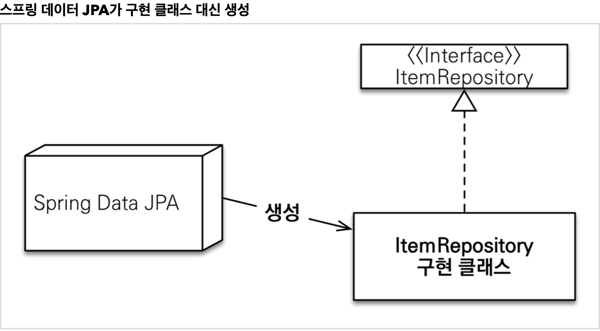

# 5주차

## 공통 인터페이스 기능

### 스프링 데이터 JPA가 구현 클래스 대신 생성

* org.springframework.data.repository.Repository 를 구현한 클래스는 스캔 대상 
  * MemberRepository 인터페이스가 동작한 이유 
  * 실제 출력해보기(Proxy)
  * memberRepository.getClass() class com.sun.proxy.$ProxyXXX
* @Repository 애노테이션 생략 가능 
  * 컴포넌트 스캔을 스프링 데이터 JPA가 자동으로 처리 
  * JPA 예외를 스프링 예외로 변환하는 과정도 자동으로 처리
### 공통 인터페이스 구성
* JpaRepository 인터페이스: 공통 CRUD 제공 
* 제네릭은 <엔티티 타입, 식별자 타입> 설정
* 주요 메서드 
  * save(S) : 새로운 엔티티는 저장하고 이미 있는 엔티티는 병합한다. 
  * delete(T) : 엔티티 하나를 삭제한다. 내부에서 EntityManager.remove() 호출 
  * findById(ID) : 엔티티 하나를 조회한다. 내부에서 EntityManager.find() 호출 
  * getOne(ID) : 엔티티를 프록시로 조회한다. 내부에서 EntityManager.getReference() 호출 
  * findAll(...) : 모든 엔티티를 조회한다. 정렬( Sort )이나 페이징( Pageable ) 조건을 파라미터로 제공할 수 있다.
* JpaRepository 는 대부분의 공통 메서드를 제공한다
  